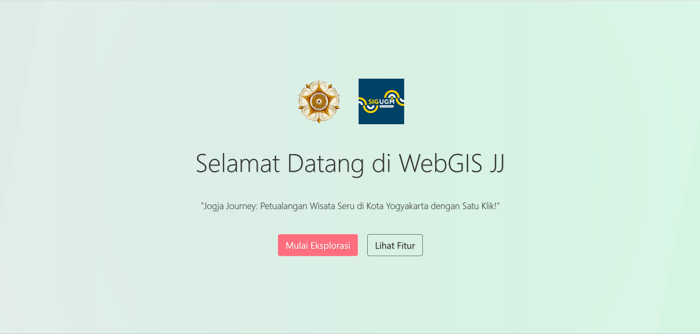
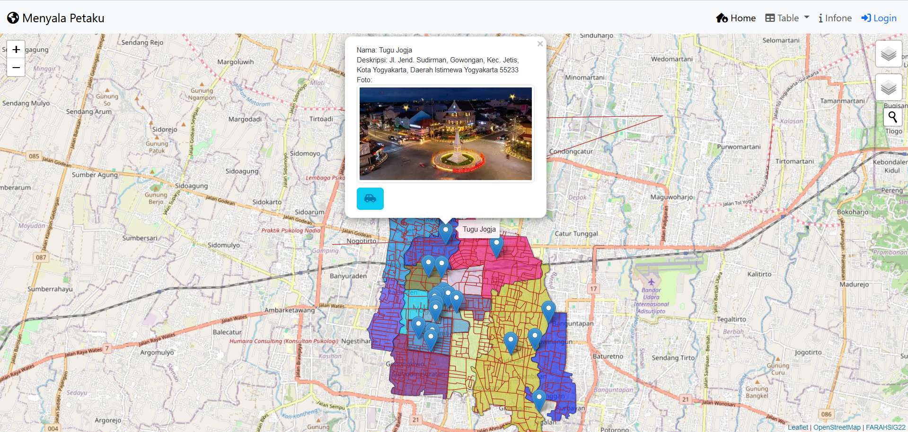
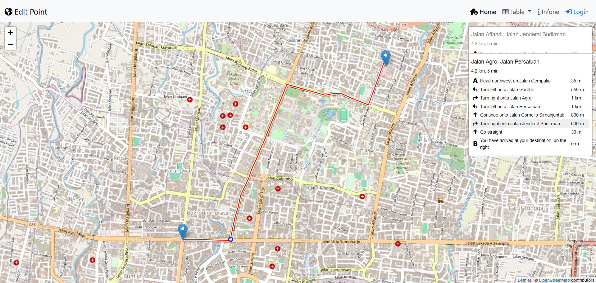
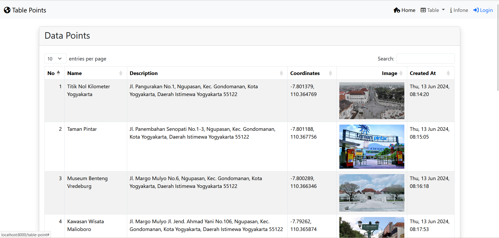

# 🌏 WebGIS Wisata Kota Yogyakarta 🗺️



Selamat datang di WebGIS Wisata Kota Yogyakarta! Proyek ini bertujuan untuk menyediakan peta interaktif yang menampilkan berbagai tempat wisata di Kota Yogyakarta. Dengan menggunakan teknologi Geographic Information System (GIS), pengguna dapat dengan mudah menjelajahi lokasi wisata dan mendapatkan informasi detail mengenai tempat-tempat tersebut.

## 🎉 Fitur Utama

- **🌐 Peta Interaktif**: Menampilkan peta Kota Yogyakarta dengan berbagai tempat wisata yang dapat dinavigasi.
- **🔍 Detail Tempat Wisata**: Informasi lengkap tentang setiap tempat wisata, termasuk deskripsi, gambar, dan alamat.
- **📌 Layer Kontrol**: Pengguna dapat memilih dan mengatur layer yang ingin ditampilkan pada peta.
- **💬 Popup & Tooltip**: Menampilkan informasi singkat ketika pengguna mengarahkan atau mengklik pada lokasi wisata.
- **📱 Responsif**: Desain yang menyesuaikan dengan berbagai perangkat, baik desktop maupun mobile.
- **🛣️ Routing**: Pengguna dapat mendapatkan rute dari lokasi terkini menuju destinasi wisata yang dituju.
- **📷 Galeri Foto**: Menampilkan galeri foto tempat wisata.
- **📍 Penanda Lokasi**: Tambahkan penanda lokasi favorit Anda.

## 🛠️ Teknologi yang Digunakan

- [Leaflet](https://leafletjs.com/) - Library JavaScript untuk peta interaktif.
- [GeoJSON](https://geojson.org/) - Format data spasial untuk menyimpan informasi geografis.
- [Bootstrap](https://getbootstrap.com/) - Framework CSS untuk desain responsif dan modern.
- [jQuery](https://jquery.com/) - Library JavaScript untuk manipulasi DOM dan AJAX.
- [FontAwesome](https://fontawesome.com/) - Ikon vektor yang dapat disesuaikan.

## 📂 Struktur Direktori


## 🚀 Instalasi

1. **Clone repositori:**

    ```bash
    git clone https://github.com/username/webgis-wisata-yogyakarta.git
    cd webgis-wisata-yogyakarta
    ```

2. **Buka file `index.html` di browser:**

    Anda bisa langsung membuka file ini di browser dengan cara double-click atau dengan menggunakan live server jika menggunakan code editor seperti VS Code.

## 💡 Penggunaan

- **Navigasi Peta**: Gunakan mouse untuk menggeser peta dan scroll untuk zoom in/out.
- **Interaksi dengan Lokasi**: Klik pada lokasi wisata untuk melihat informasi lebih detail.
- **Layer Kontrol**: Gunakan kontrol layer di pojok kanan atas untuk memilih layer yang ingin ditampilkan.
- **Rute**: Klik pada titik Wisata lalu memilih tombol rute untuk mendapatkan rute perjalanan.

## 🖇️ Kontribusi

Kami sangat mengapresiasi kontribusi dari Anda! Untuk berkontribusi, ikuti langkah-langkah berikut:

1. **Fork repositori ini** dengan mengklik tombol "Fork" di kanan atas.
2. **Clone repositori forked** ke mesin lokal Anda:

    ```bash
    git clone https://github.com/username/webgis-wisata-yogyakarta.git
    cd webgis-wisata-yogyakarta
    ```

3. **Buat branch fitur baru** untuk perubahan Anda:

    ```bash
    git checkout -b fitur-baru
    ```

4. **Commit perubahan Anda**:

    ```bash
    git commit -m 'Menambahkan fitur baru'
    ```

5. **Push ke branch**:

    ```bash
    git push origin fitur-baru
    ```

6. **Buat Pull Request** di GitHub dan deskripsikan perubahan Anda.

Kami akan meninjau Pull Request Anda secepat mungkin! Terima kasih atas kontribusinya!

## 📄 Lisensi

Proyek ini dilisensikan di bawah [MIT License](LICENSE). Anda bebas menggunakan dan mengubah proyek ini sesuai dengan ketentuan lisensi.

## 📸 Cuplikan Gambar

### Peta Interaktif



### Perjalanan Menuju Tempat Wisata



### Daftar Tabel Wisata



---

**Dikembangkan oleh [Muhammad Nashan Fauzian](https://github.com/username).**

Untuk pertanyaan lebih lanjut, silakan hubungi saya melalui [muhammadnashanfauzian1404@mail.ugm.ac.id](mailto:muhammadnashanfauzian1404@mail.ugm.ac.id).

Jangan lupa untuk ⭐ repositori ini jika Anda merasa proyek ini bermanfaat! Terima kasih telah berkunjung dan selamat menjelajah Yogyakarta! 🎉
